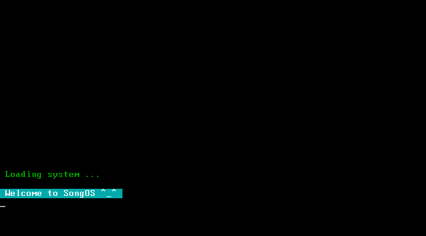
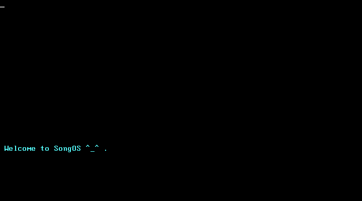
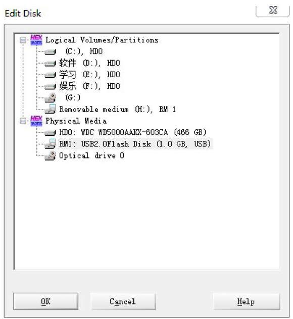

# SongOS
A really simple toy OS that can be done in a few hours.

参考XJTU OS实验参考书实现，并做了改进和解释说明

完成这个项目只需要基本的OS和汇编知识，是很合适入门的OS项目 ^_^ 

## 虚拟机运行
### Step 1 简单引导启动程序
设置软盘启动，软盘映像文件选择 [boot.img](step1/boot.img) 
启动后可看到下面界面，并听到蜂鸣器响声。
（若虚拟机为bochs则听不到，这里用的是VMware）

### Step 2 简单多任务操作系统
本操作系统参考了Linux-0.00，具体网址点击 [Linux.old](http://oldlinux.org/Linux.old/bochs/) 

设置软盘启动，软盘映像文件选择 [SongOS.img](step2/SongOS.img) 
启动后可看到下面界面，

任务0和任务1分别输出A，B

## U盘实机运行
在 linux 下 make 得到 **Image文件** 
将 **Image文件** 的值复制到U盘起始位置后保存（即修改第一个扇区值） 
修改U盘工具随意，winHex示例如下:

之后只要确保PC支持从U盘启动即可。
